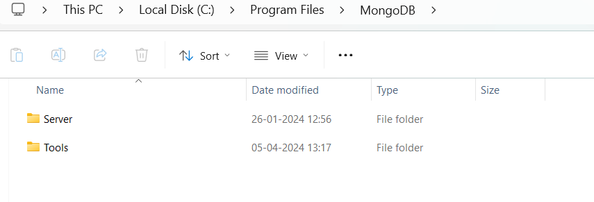
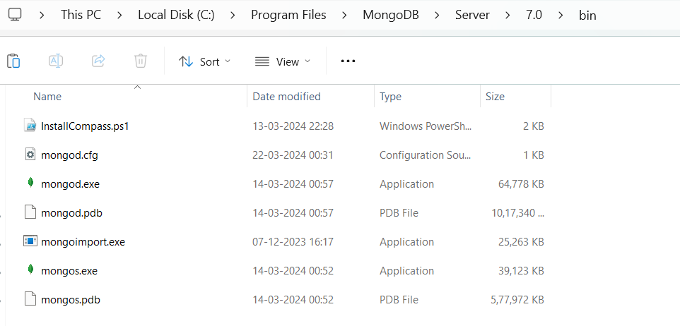

Date:04/04/2024
---------------

## Task1 : we will insert documents in mongodb collection through javascript(.js) file.

### Step:1 : 
Install mongodb import through https://www.mongodb.com/try/download/database-tools .

After installing this :
- Go to C Drive -->  Program files -->  MongoDB 
- Here You can see two folders first one is Server and  second one is Tools .

- Tools folder came after installing the following.

### Step:2
- Go to **Tools** folder --> 100 ---> bin --> mongoimport.exe (Copy this file) 
- Now go back to **Server** folder --> 7.0 --> bin --> Paste the file you have copied from  _Tools folder_ that is **mongoimport.exe**.
- Now your (Server/7.0/bin)  all this files should present.

### Step:3
- open 1st cmd and run mongod (_to start mongodb server_)
- open 2nd cmd and run mongosh (_to start mongodb shell_)

### Step:4
- To insert documents through javascript(.js) file create a JavaScript file (in that js file you have to write all your codes) in any location and my location is   (_"E:\\MongodbPracticals\\Code\\employee.js"_)  
- Now in mongodb shell run this command by choosing a Database :
 _load("E:\\MongodbPracticals\\Code\\employee.js")_

> [!NOTE] After execution of this command then it will create a collection with "employee" name inside currect working database.


______________________________________________
> My runable code are :

```
test> show dbs
Book         40.00 KiB
Order        72.00 KiB
Roadmap       8.00 KiB
admin        40.00 KiB
bhide        76.00 KiB
config       72.00 KiB
local        72.00 KiB
university  112.00 KiB
test> use university
switched to db university
university> load("E:\\MongodbPracticals\\Code\\employee.js")
true
university> show collections
employee
students
university> db.employee.find()
[
  {
    _id: ObjectId('660466afb4d898ccce9f990e'),
    ename: 'Ram',
    esal: 22000,
    yoj: 2022
  },
  {
    _id: ObjectId('660466afb4d898ccce9f990f'),
    ename: 'Sam',
    esal: 12000,
    ypj: 2023
  },
  {
    _id: ObjectId('660466afb4d898ccce9f9910'),
    ename: 'jak',
    esal: 20000
  },
  {
    _id: ObjectId('660faeb38d92441c469f990b'),
    name: 'Priyanka',
    age: 24,
    company: 'HP',
    sal: 75000
  }
]
```
- It added the document which is present in employee.js file that is name=priyanka document so previously 3 documents are present in my employee collection.


========================================

## Task2 :we will insert documents in mongodb collection through javascript object natation (.json) file.

