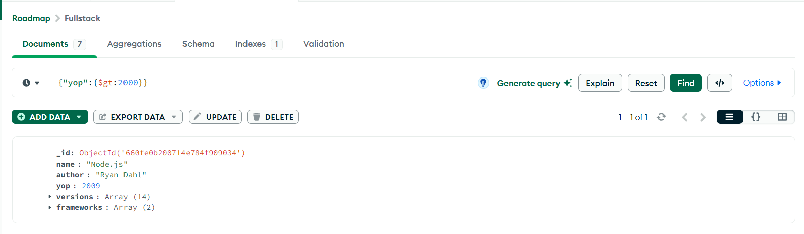
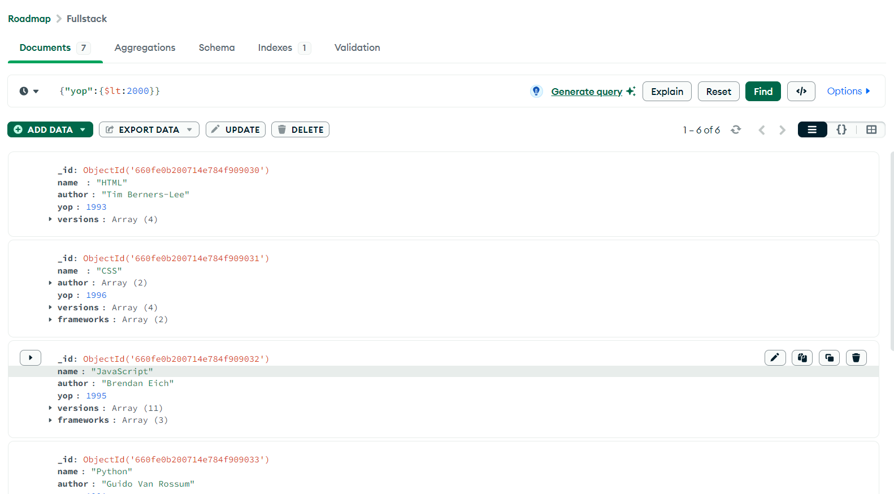
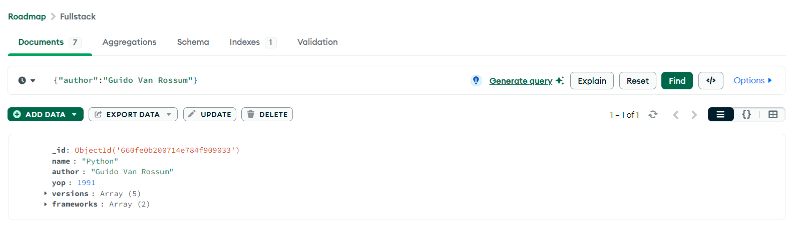
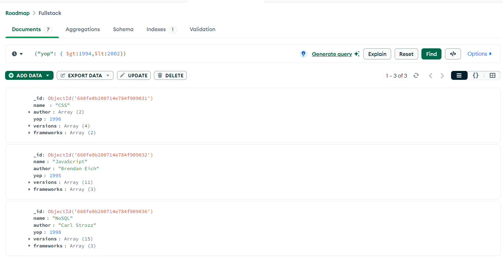

Date:04/04/2024
---------------

## Task1 : we will insert documents in mongodb collection through javascript(.js) file.

### Step:1 : 
Install mongodb import through https://www.mongodb.com/try/download/database-tools .

After installing this :
- Go to C Drive -->  Program files -->  MongoDB 
- Here You can see two folders first one is Server and  second one is Tools .

- Tools folder came after installing the following.

### Step:2
- Go to **Tools** folder --> 100 ---> bin --> mongoimport.exe (Copy this file) 
- Now go back to **Server** folder --> 7.0 --> bin --> Paste the file you have copied from  _Tools folder_ that is **mongoimport.exe**.
- Now your (Server/7.0/bin)  all this files should present.

### Step:3
- open 1st cmd and run mongod (_to start mongodb server_)
- open 2nd cmd and run mongosh (_to start mongodb shell_)

### Step:4
- To insert documents through javascript(.js) file create a JavaScript file (in that js file you have to write all your codes) in any location and my location is   (_"E:\\MongodbPracticals\\Code\\employee.js"_)  
- Now in mongodb shell run this command by choosing a Database :
 _load("E:\\MongodbPracticals\\Code\\employee.js")_

> [!NOTE] After execution of this command then it will create a collection with "employee" name inside currect working database.


______________________________________________
> My runable code are :

```
test> show dbs
Book         40.00 KiB
Order        72.00 KiB
Roadmap       8.00 KiB
admin        40.00 KiB
bhide        76.00 KiB
config       72.00 KiB
local        72.00 KiB
university  112.00 KiB
test> use university
switched to db university
university> load("E:\\MongodbPracticals\\Code\\employee.js")
true
university> show collections
employee
students
university> db.employee.find()
[
  {
    _id: ObjectId('660466afb4d898ccce9f990e'),
    ename: 'Ram',
    esal: 22000,
    yoj: 2022
  },
  {
    _id: ObjectId('660466afb4d898ccce9f990f'),
    ename: 'Sam',
    esal: 12000,
    ypj: 2023
  },
  {
    _id: ObjectId('660466afb4d898ccce9f9910'),
    ename: 'jak',
    esal: 20000
  },
  {
    _id: ObjectId('660faeb38d92441c469f990b'),
    name: 'Priyanka',
    age: 24,
    company: 'HP',
    sal: 75000
  }
]
```
- It added the document which is present in employee.js file that is name=priyanka document so previously 3 documents are present in my employee collection.


========================================

## Task2 :we will insert documents in mongodb collection through javascript object natation (.json) file.

- create jsoon file in any loaction :
  - my location is :   (_"E:\MongodbPracticals\Code\faculty.json"_)  
- Now open a new cmd(this is 3rd cmd) and go to faculty.json file.


```
PS C:\Users\ASUS> E:
PS E:\> cd MongodbPracticals
PS E:\MongodbPracticals> cd Code
PS E:\MongodbPracticals\Code> mongoimport --db Tuition --collection teachers --file faculty.json --jsonArray
2024-04-05T16:14:21.074+0530    connected to: mongodb://localhost/
2024-04-05T16:14:21.181+0530    3 document(s) imported successfully. 0 document(s) failed to import.


```
- Now open mongodb shell

``` 
test> show dbs
Book         40.00 KiB
Order        72.00 KiB
Roadmap       8.00 KiB
Tuition      40.00 KiB
admin        40.00 KiB
bhide        76.00 KiB
config       60.00 KiB
local        72.00 KiB
university  144.00 KiB
```
- So it created Tution database and added collection .

```
test> use Tuition
switched to db Tuition
Tuition> show collections
teachers
Tuition> db.teachers.find()
[
  {
    _id: ObjectId('660fd6056dc554985f96ee61'),
    name: 'priaynka',
    domain: 'Biology',
    exp: 2,
    yoj: 2023
  },
  {
    _id: ObjectId('660fd6056dc554985f96ee62'),
    name: 'Zini',
    domain: 'Chemistry',
    exp: 3,
    yoj: 2022
  },
  {
    _id: ObjectId('660fd6056dc554985f96ee63'),
    name: 'surendra',
    domain: 'AI and DSA',
    exp: 5,
    yoj: 2024
  }
] 
```


## COMPASS:
### OPERATIONS:
(1)WMQ to get all the  name documents is greater than 2000.
``` 
for cmd: db.Fullstack.find({"yop":{$gt:2000}})
for compass:{"yop":{$gt:2000}}
```


(2)WMQ to get all the  name documents is less than 2000.
``` 
for cmd: db.Fullstack.find({"yop":{$lt:2000}})
for compass:{"yop":{$lt:2000}}

```


(3)WMQ to get deatils about the language name written by Guido Van Rossum.

``` 
for cmd: db.Fullstack.find({"author":"Guido Van Rossum"})
for compass:{"author":"Guido Van Rossum"}

```


(4)WMQ to get all author names.

``` 
for cmd: db.Fullstack.find({}, { "Author": 1, "_id": 0 })
for compass:{}

```


(5)WMQ to get the versions of SQL.


(6) WMQ to display all the languages those who have published in between 1994 to 2002.
``` 
for cmd: db.Fullstack.find({"yop":{ $gt:1994,$lt:2002}} )
for compass:  {"yop": { $gt:1994,$lt:2002}}
```



(9)WMQ to display all the names based on yop.